[Back to the top (index)](README.md)

# AI API connect

TraceExpert component *AI API Connect Engine* provides an interface to connect with the AI API server made by the team at FIT VUT (Brno). For details on this server, please see  [their GitLab](https://gitlab.utko.feec.vutbr.cz/xsikor14/dl-sca-api). Documentation on how to set the server up (Czech only) can be downloaded [here](files/aiServerSetup.pdf). The plugin let's the uer to connect to any number of servers.

**Please note that this component could not be thoroughly tested so it is in <u>beta</u>.**

## Requirements

- Installed HDF5 library version 1.x  (2.x may work but was not tested).

## Pre-init parameters

This component has no pre-init paramteres. When initializing, just click *Initialize*.

## Connecting to a server (adding a new device)

1. Click Add device and select *AI API Connect engine*

2. Ignore post-init parameters and click *Next*

3. Clik on *Add* and name your device (the name is just for you)

4. Select the added device and click *Next*

5. Configure the conection parameters and click *Next* Make sure to select the correct data type you will be passing to the device. 
   
   - *Text* means that traces are sent in ASCII and values are separated by a newline. 
   
   - int64/uint64 only retain 2^52 bytes of precision.

6. Done
   
   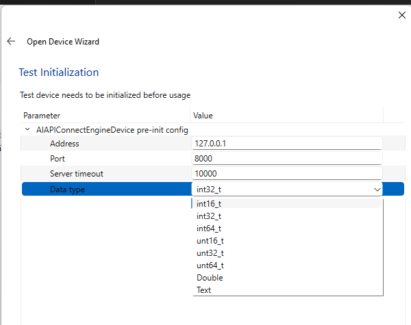

## Using a device/server

### Configuration

1. First, click *Apply* in the Post-init paramters window (top-right). This ensures synchronization between the sever and TraceXpert.

2. Next, select the mode you want to use. Either *Predict* or *Train*, depending on the opration you want to perform.

### Uploading data

Please note that you can only upload traces and datasets for training or predition using this component. Uploading ready-made models is not supported as it is the limitation of the sever itself. If you wish to upload a model, you need to upload it directly to tre correct directory using, for example, scp. For details, please see [VUT GitLab](https://gitlab.utko.feec.vutbr.cz/xsikor14/dl-sca-api).

When uploading data for training, you have two options:

1. Upload trace(s).
   
   1. In this case, you need to configure all of the *Upload params*.
      
      - Dataset name: Any name that does not exist yet
      
      - Override ...: False
      
      - HDF5 file path: *empty*
      
      - Class no.: The class number you want to upload to
      
      - Trace size: trace size (in number of values, not in bytes)
        
        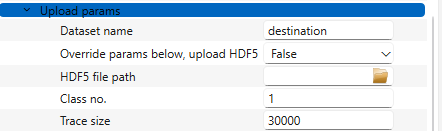
   
   2. Click *Apply*
   
   3. Next, send the traces to the *Training input* stream. Either as raw input or as a file. If you're using the *Text* mode, separate values by newlines. In any case, do not separate traces in any way (the component does this automatically based on the *Trace size* parameter).
      
      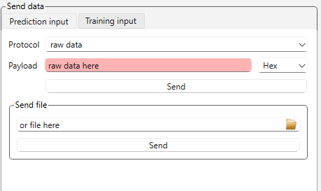
   
   4. Run the *Upload data (traces)* action.
      
      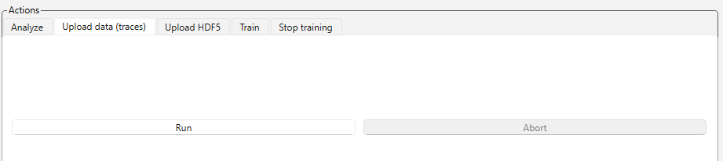
   
   5. (Check the result in the *Training result* stream.)
   
   6. Once you upload, you can click the *Apply* button and you will see the list of uploaded datasets and their details.

2. Upload a HDF5 dataset.
   
   1. In this case, you need to configure only some of the *Upload params*.
      
      - Dataset name: Any name that does not exist yet
      
      - Override ...: True
      
      - HDF5 file path: path to your HDF5 file
      
      - Class no.: *ignored*
      
      - Trace size: *ignored*
        
        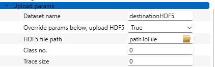
   
   2. Click *Apply*.
   
   3. Run the *Upload HDF5* action.
      
      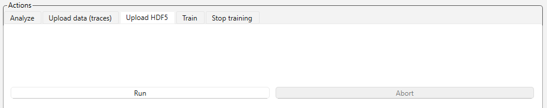
   
   4. (Check the result in the *Training result* stream.)
   
   5. Once you upload, you can click the *Apply* button and you will see the list of uploaded datasets and their details.

Both of these variants can also be run from scenarios.

### Prediction

1. Assuming the server is in prediction mode, set the used model (which needs to be already present on the server - see *Uploading data*) and the prediction input size in number of samples (not bytes).

   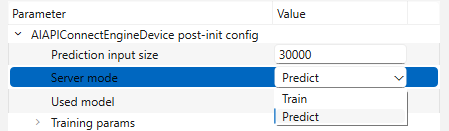

2. Click *Apply*.

3. Send your data into the *Predition input stream*. You can either:
   
   - send raw data in hex (input your data and click *Send*,
   
   - send a file (input the path to your file and click *Send*) or
   
   - send data from a scenario (for that option, please refer to [scenario documentation](scenario.md)).
     
     

4. To run the prediction, you need to run the *Analyze* action. 

   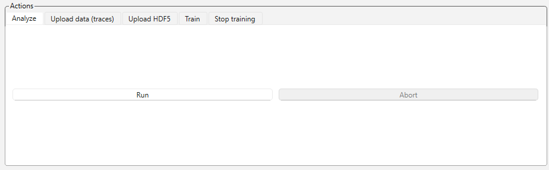

5. To receive the prediction result, you need to receive data from the *Prediction result* stream. You will receive one result per sent trace. If your format is *Text*, the results will be separated by a newline. Otherwise, you receive an array. You can, of xourse, turn on *Autoreceive*.
   
   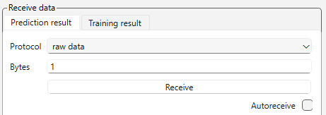

6. All of these actions can also be done from the scenarios.

### Training

1. Assuming the server is in training mode, you need to select the training parameters according to the documentation of the server. You also need to name the destination model and select the dataset (already present on the server) as the training source. Do not forget to click *Apply*. 
   
   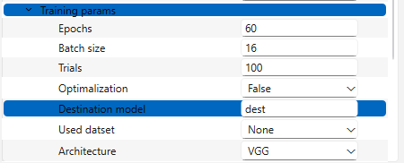

2. Now you can start the training by running the *Train* action.
   
   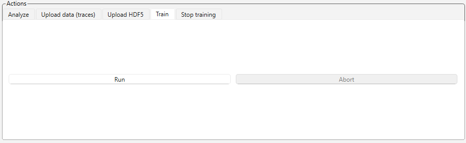

3. You can see the current status in the params window. For update, click *Apply*.
   
   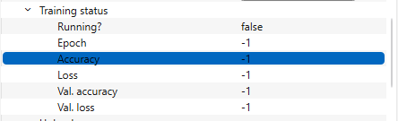

4. You can stop the training by running the *Stop training* action.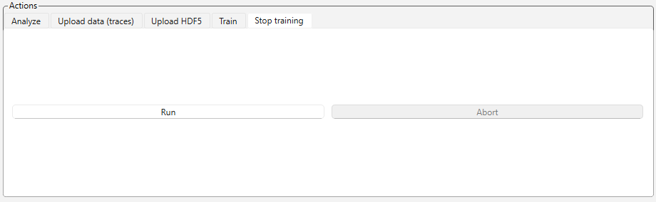

5. You can receive the training result in the *Training resut* stream.
   
   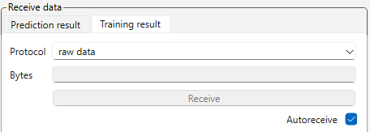

6. All of these actions can also be done from the scenarios.

