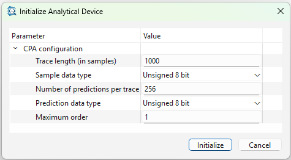
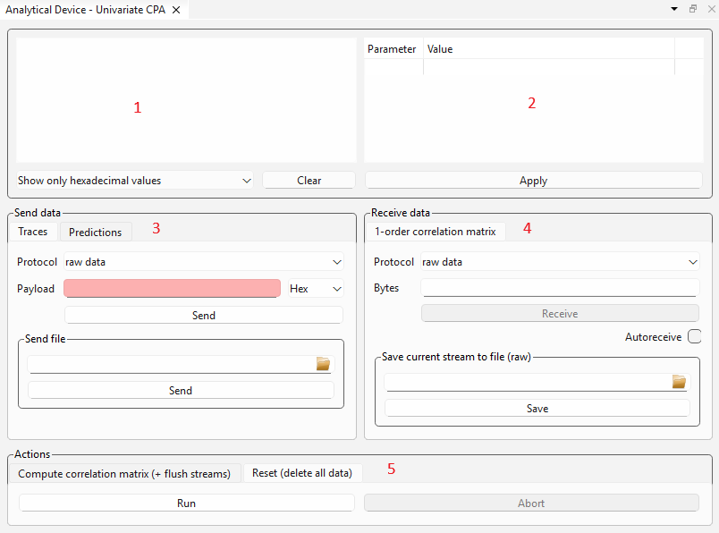

[Back to the top (index)](README.md)

# Analytical Devices

Some TraceXpert components provide an **Analytical Device**. This page describes standalone usage of the Analytical Device using a graphical widget. *Furthermore, the Analytical Device may be used in [Scenarios](scenarios.md) in an automated fashion.*

For further information about specific Analytical Devices, please refer to the subpages describing individual Analytical Device components.

## Initialization

Currently all Analytical Device components contain Analytical Devices without further ability to add one manually.

The Analytical Device is then initialized in a similar fashion, as the component (through the wizard or right-clicking on it). Different Analytical Devices may offer different pre-initialization and post-initialization parameters. 

When the Analytical Device is initialized, an Analytical Device widget opens. It can also be opened by right-clicking the Analytical Device in the Project manager and selecting Show.

## Analytical Device widget

The Analytical Device widget behavior is similar to [I/O Devices widgets](iodevices.md). Please refer to them first. It allows to:

* Configure the Analytical Device using its parameters. 
* Send and receive raw data from the analytical device, or use [protocols messages](protocols.md).
* Send contents of a file, and receive data to a file.

The Analytical Device widget further allows to:

* Send and receive data to and from **input and output streams** of the analytical device.
* Run **Actions**

Unlike I/O Devices, the Analytical Devices typically offer multiple input streams, to which the data may be send, and multiple output streams, from which the data may be received. Furthermore, Analytical Devices offer Actions, which typically launch a computation upon the data submitted to the streams. These Streams and Actions differ for every Analytical Device component, for further information please refer to the individual component subpages.

Below is the widget screenshot with further description.

1. Communication log with the same behavior as in [I/O Devices widgets](iodevices.md).
2. Post-initialization parameters with the same behavior as in [I/O Devices widgets](iodevices.md).
3. Multiple streams to which the data can be sent. In this case, two streams *Traces* and *Predictions* of the [CPA](cpa.md) device. The rest of the Send data block behaves the same as in [I/O Devices widgets](iodevices.md).
4. Multiple streams from which the data can be received. The rest of the Receive data block behaves the same as in [I/O Devices widgets](iodevices.md).
5. Multiple actions available on the Analytical Device. In this case, two actions of the [CPA](cpa.md) device. Every action may be *Run* or *Aborted*. 

