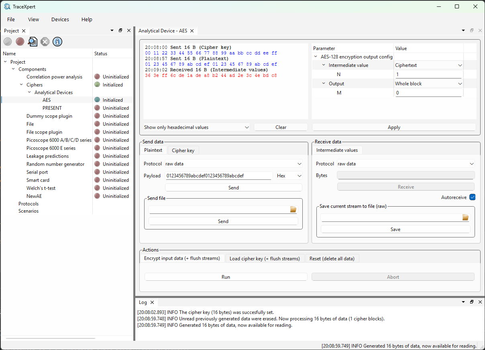

[Back to the top (index)](README.md)

# Ciphers

TraceExpert component *Ciphers* generates intermediate values during encryption/decryption.

The component contains two analytical devices, AES and PRESENT. The AES device supports 128, 192 and 256-bit key lengths. The PRESENT device supports 80 and 128-bit key lengths.

## AES

The component contains an analytical device for AES, which generates intermediate values during either encryption or decryption.

### Pre-initialization configuration

The **Key length** parameter sets key length (possible values are 128, 192 or 256 bits).

The **Operation** parameter is either *Encryption* or *Decryption*.

### Post-initialization configuration

The **Intermediate value** parameter sets the intermediate value which is returned by the analytical device. In case of encryption can be one of the follows:

1. Plaintext
2. After Nth AddRoundKey
3. After Nth SubBytes
4. After Nth ShiftRows
5. After Nth MixColumns
6. Ciphertext

where **N** is set as the *Intermediate value* subparameter. In case of decryption, the selection of intermediate values includes inverse operations.

The **Output** parameter can be one of the follows:

1. **Whole block** - The analytical device returns the whole cipher context (size of the block).
2. **Mth byte** -- The analytical device returns only the selected byte (leftmost byte is 0).
3. **Mth bit** -- The analytical device returns only the selected bit, as a byte-sized value, i.e. 0x00 or 0x01 (rightmost bit is 0).

### Input

The stream **Plaintext**/**Ciphertext** accepts full blocks of AES, i.e. 16 bytes of plaintext/ciphertext per block.

The stream **Cipher key** accepts an AES key of the correct length (according to the pre/initialization settings).  

### Actions

1. **Encrypt input data (+ flush streams)** first *deletes all unread data from the output streams buffers* and then processes the AES input blocks from the input stream. The selected intermediate values are then ready to be read from the output stream. The action fails when an invalid amount of data was previously submitted to the input stream (the number of bytes must be divisible by 16).

2. **Load cipher key (+ flush streams)** first *deletes all unread data from the output streams buffers* and then loads the key from *Cipher key* stream into the AES engine. The action fails when an invalid amount of data was previously submitted to the cipher key stream (incorrect number of bits according to the key length settings of the device).  

2. **Reset (delete all data)** resets the state of the analytical device to the after-init state.

### Output

After the **Encrypt input data (+ flush streams)** action finishes, the requested intermediate values are available for reading from the **Intermediate values** stream.

### Example usage 1

The analyst has 10 plaintext that she wishes to examine. She wants to know the AES-128 cipher state after the 2nd MixColumns operation.

She configures the *AES* analytical device for 128-bit key length and encryption. Then she submits her 16-byte cipher key to the **Cipher key** stream and launches **Load cipher key** action. 

After that, she selects **After Nth MixColumns** and sets **N** to *2*. She applies the settings. She is interested with the entire cipher state, so she keeps **Output** at *Whole block*.

Then she submits 10 plaintexts (10\*16 bytes) to the **Plaintext** stream, launches **Encrypt input data** action, and reads 10 blocks (10\*16 bytes) from the **Intermediate values** stream.

### Example usage 2

The analyst wants to perform a specific t-test aimed at bit 0 after the 1st SubBytes. She sets the **Intermediate value** to *After Nth SubBytes*, **N** to *1*, and she sets the **Output** to *Mth bit*.

The **Intermediate values** stream then returns a byte (0x00 or 0x01) for every submitted plaintext, according to the bit value in the selected intermediate value.

These byte-sized values can then be used as labels for the **Welch's t-test** component.

## PRESENT

The component contains an analytical device for PRESENT, which generates intermediate values during either encryption or decryption.

The differences compared to the AES device are as follows:
1. The block is of size 64 bit, compared to 128 bits in AES.
2. The key lengths are either 80 or 128 bits-

Otherwise, the usage of the PRESENT analytical device is the same as for AES. 

