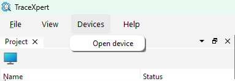
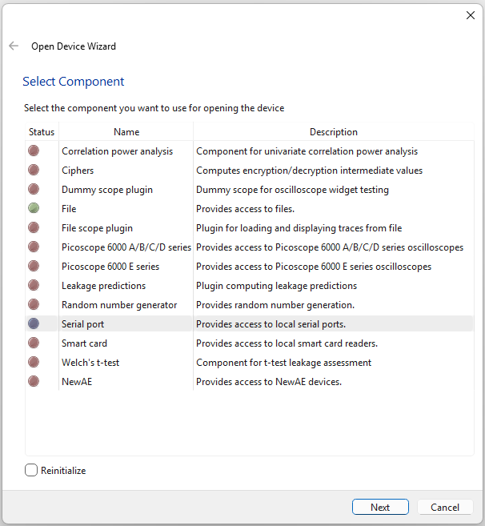
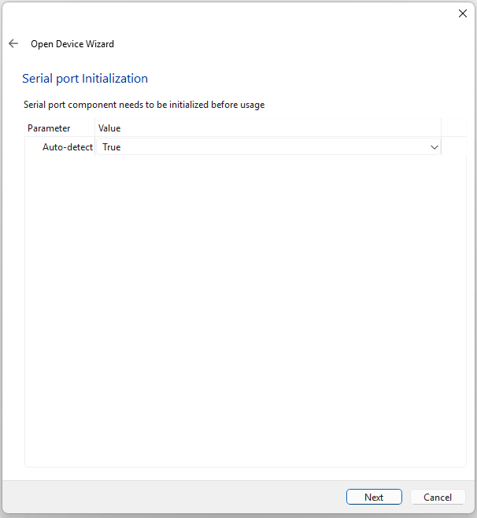
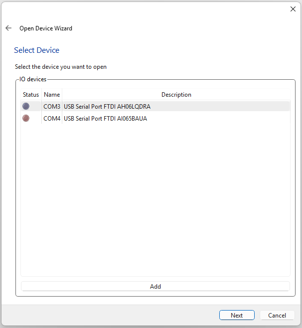
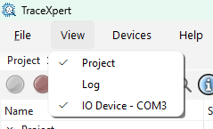
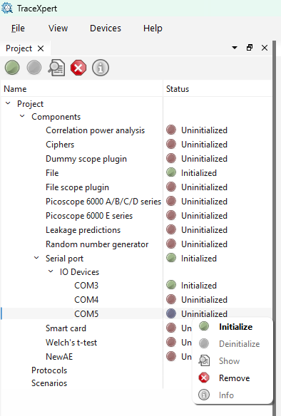
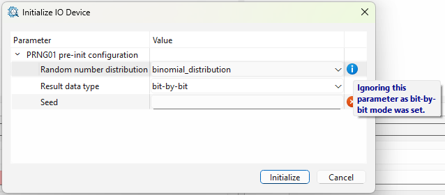

[Back to the top (index)](README.md)

# Components and Devices

Part of the functionality of TraceXpert is provided by modules called Components. These act as a driver for hardware device or provide some specialized functionality. 

Different Components further provide different types of Devices:

* **[I/O Device](iodevices.md)**, implementing communication using [serial port](serialport.md), [SmartCard](smartcard.md), [NewAE ChipWhisperer](newae.md), access to local [files](file.md), or to [random number generators](rng.md).
* **[Oscilloscope](oscilloscopes.md)**, providing support for measurements and downloading the data from a scope such as [NewAE ChipWhisperer](newae.md) or [Picoscope 6000 series](picoscope6000.md).
* **[Analytical Device](analytical.md)**, which provides computation-heavy operations such as [Correlation power analysis](cpa.md), [Welch's t-test](ttest.md), [Leakage predictions computation](predictions.md) or [Working variable enumeration](ciphers.md).

Moreover, important capabilities implemented directly are:

* **[Scenarios](scenarios.md)**, which offer a graphical definition of a workflow and allows it to be run in an automated fashion.
* **[Protocols](protocols.md)**, allowing a simple definition of communication protocols, messages and field, providing an easy way for an advanced communication using I/O devices.

A component needs to be **configured first (pre-init configuration)** and then it can be **initialized**. After the initialization, the component may allow **further configuration (post-init configuration)**.

Some components may allow for auto-detect of connected physical devices (such as [serial port](serialport.md) or [oscilloscope](oscilloscopes.md) components) and create these automatically. Other components may require user to manually add devices (such as [file](file.md)), or they may create default devices (such as components providing [Analytical Devices](analytical.md)).

An existing device (of any type) needs to be **configured first (pre-init configuration)** and then it can be **initialized**. After the initialization, the component may allow **further configuration (post-init configuration)**.

An initialized device (of any type) can be controlled using its **widget** or in a **scenario**, which allows for an automatized workflow.

## Initialization of a component/device - Method 1: Using wizard

When a project is open/created, a device of any kind may be initialized using a wizard, found in **Devices > Open Device**.

The wizard opens, offering components to choose from:

The green dot next to a component means the component was already initialized before. Therefore, when select, the component initialization is skipped and available devices are directly offered.

A new initialization is done when *Reinitialize* is selected. Note that all open devices, provided by this component, will be closed when reinitalizing.

The red dot next to a component means the component need to be initialized first. When select, the wizard requires pre-initialization parameters:

If the initialization is successful, available devices are offered by the wizard:
 

 
If the device is missing or no device is offered, user may add a device using *Add* button. *Name* and *Info* are arbitrary values used for the new device identification.

After a device is select and confirmed, the wizard offers its pre-initialization parameters. These must be correctly entered:

When confirmed, the device is initialized and its control widget opens. Refer to [I/O Devices](iodevices.md), [Oscilloscopes](oscilloscopes.md) and [Analytical Devices](analytical.md) for more information about these widgets. Refer to [Protocols](protocols.md) for more information about formatting messages. Refer to [Scenarios](scenarios.md) for device usage in an automated fashion.

The widget may be further hidden/opened using *View* menu:

 

## Initialization of a component/device - Method 2: Using Project manager

Besides for the wizard, components and devices may be managed using [Project Manager](ui-projects.md). Right-click on a component, type of the device or the device itself to reveal its actions:

 

## Configuration warning and errors

Both Component and Device parameters may exhibit info, warning, or error messages. These may prevent successful initialization. Pay attention to these. Hovering over the icon shows the message.

 
 
