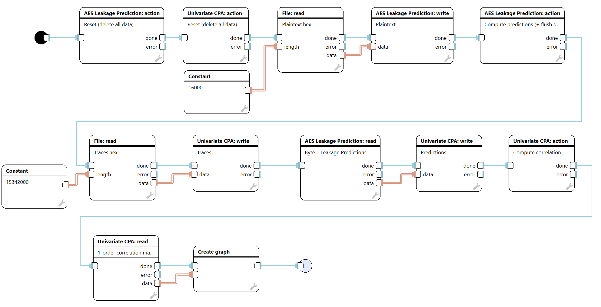
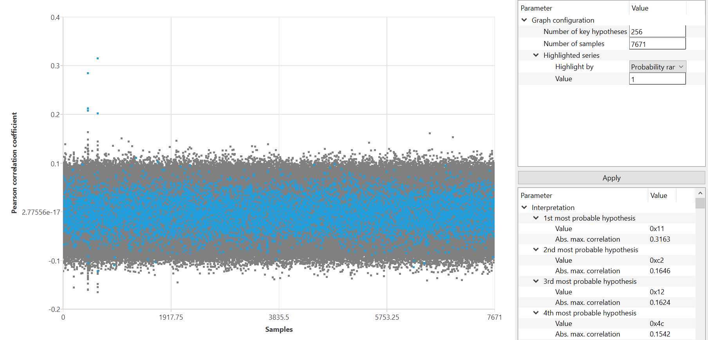

[Back to the top (index)](README.md)

# Example: Correlation Power Analysis

This guide describes a *Correlation Power Analysis (CPA)* attack on a *software implementation of AES-128* using the *Leakage Prediction* and *Correlation Power Analysis* plugins.

## Attack Overview

The CPA attack consists of the following steps:

- Creating power consumption predictions based on a key hypothesis and plaintext  
  (*Leakage Prediction* plugin)
  - The input is plaintext (in our case, a multiple of 16 bytes).
  - For each possible key byte and corresponding plaintext byte, a prediction is generated.
  - In this example, the prediction is the *Hamming weight of the state byte after the first S-box*.

- Finding the strongest correlation between key-dependent predictions and measured power consumption  
  (*Correlation Power Analysis* plugin)
  - The inputs are the predictions and the measured power traces.
  - A correlation matrix is computed between the predictions and the power consumption for each key hypothesis.

- Visualizing the results
  - The highest correlation is identified.
  - A graph is displayed for each key hypothesis, where:
    - the x-axis represents sample indices
    - the y-axis represents the *Pearson correlation coefficient*

TraceXpert also supports CPA attacks on *hardware implementations*.  
The procedure is identical, with the following differences:

- The attack targets the *last AES round* instead of the first.
- *Hamming distance* is used instead of Hamming weight.
- *Ciphertext* is used as input instead of plaintext.

## Creating the Scenario

This scenario is *sequential*.

The workflow consists of the following steps:

- Reset both analytic plugins.
- Provide plaintext input to the *Leakage Prediction* plugin.
  - The input is read from an IO Device (e.g. file, HDF5).
  - The size of the input data is specified using a constant.
- Precompute predictions using the *Compute predictions* action in the *Leakage Prediction* plugin.
- Provide input data to the *Correlation Power Analysis* plugin:
  - Power traces are read using an IO Device.
  - Predictions are read from the *Leakage Prediction* plugin using *Analytic Device Read* and forwarded to the CPA plugin using *Analytic Device Write*.
- Compute the correlation matrices using an *Analytic Device action*.
- Display the resulting correlation graph.

## Example: CPA Scenario for AES-128

The following figure shows an example scenario configuration for performing a CPA attack on AES-128, including plaintext input, leakage prediction, correlation computation, and result visualization.

The following figure shows the output correlation graph, where correlation peaks indicate the most likely key hypotheses.

## Notes on Input File Sizes

- In this example, *1000 power traces* were measured.
- Each trace contains *7671 samples*.
- The plaintext size is *16000 bytes*  
  (1000 traces × 16 bytes of plaintext per trace).
- The power trace file size is *15,342,000 bytes*, calculated as:  
  1000 × 7671 × 2  
  where each trace contains 7671 samples stored as `int16` (2 bytes per sample).

