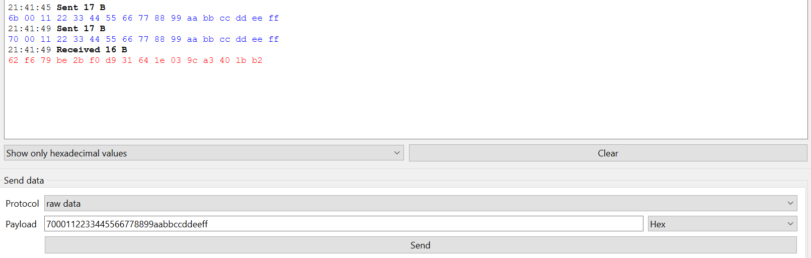
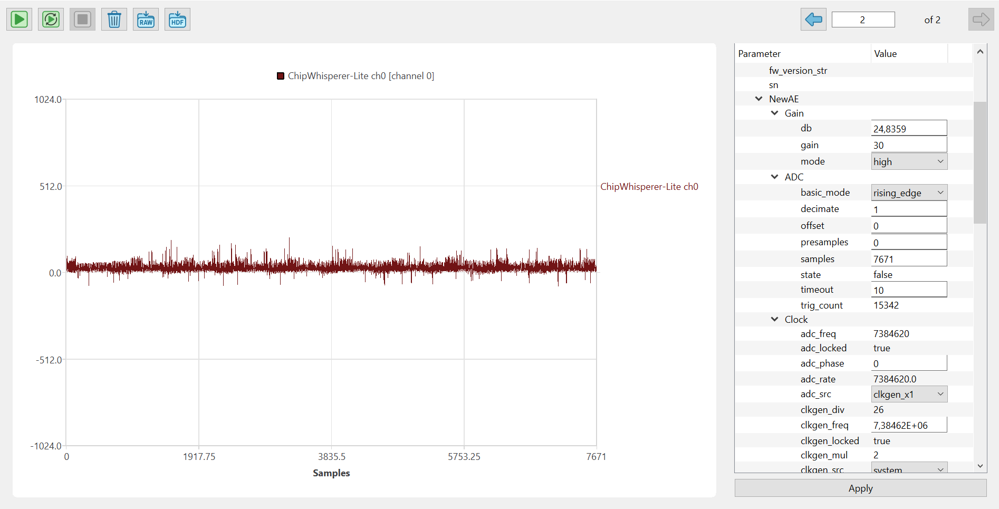
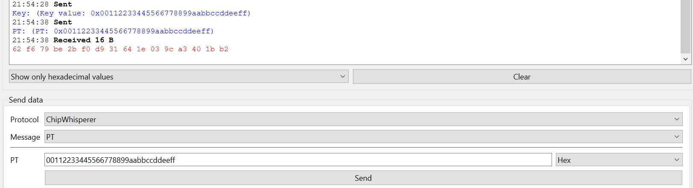
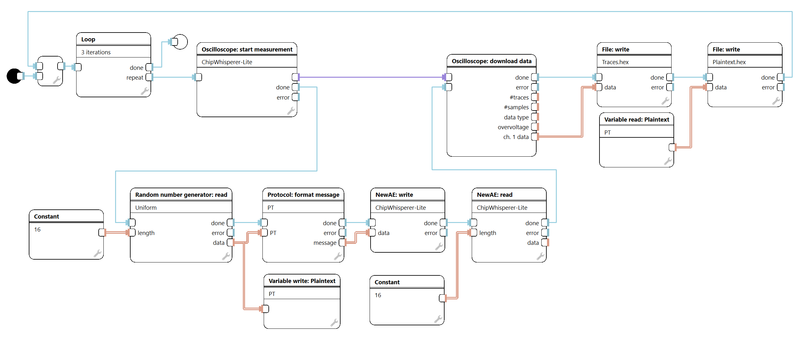
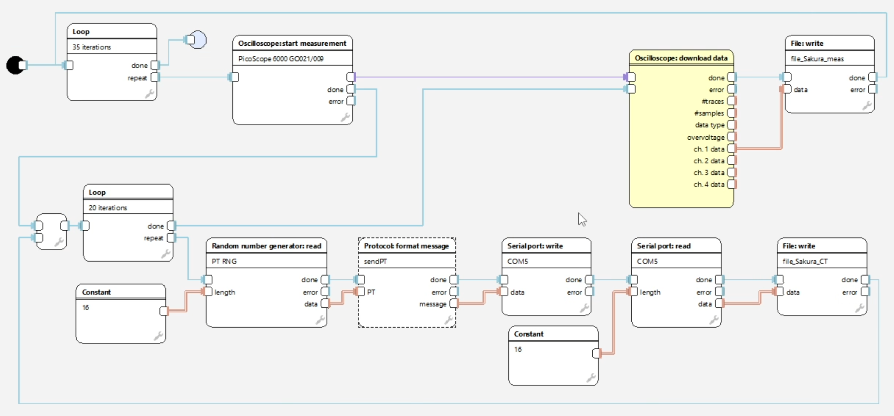

[Back to the top (index)](README.md)

# Example: Measuring Power Traces (Generic Setup)

This guide describes a general workflow for measuring power consumption traces.
The measurement setup and workflow are kept generic so they can be applied to different hardware platforms.
In this example, we use ChipWhisperer, but the same principles apply to other supported oscilloscopes and targets.

This setup **does not use the SimpleSerial protocol** and relies on a custom, minimal communication interface.

## Preparation

### Hardware preparation

- A prepared measurement setup (e.g. ChipWhisperer, PicoScope, or another supported oscilloscope)
- The target device must have a prepared communication interface for sending data to and receiving data from the target.
- It must also provide a trigger signal on operations of interest, which is used to start oscilloscope acquisition.
- The oscilloscope is physically connected to the target and trigger signals are correctly wired.

### Example target communication interface

As a concrete example used throughout this guide, consider a target device implementing AES-128 with a simple command-based interface:

- Command `k` followed by 16 bytes  
  Loads an encryption key into the target. This command does not trigger a measurement.
- Command `p` followed by 16 bytes  
  Starts encryption, enables the trigger, and returns 16 bytes of ciphertext.

This type of interface is sufficient to demonstrate command formatting using protocols, triggered trace acquisition, and collection of plaintext, ciphertext, and power traces.

### Software preparation

Required software and dependencies depend on the selected oscilloscope and plugins.
Detailed installation and configuration instructions can be found in the documentation of the individual plugins.

- For ChipWhisperer, this typically means a working Python installation with the PySide6 and chipwhisperer packages installed.
- For PicoScope, this typically means installing the appropriate PicoScope SDK.

## Component Initialization (ChipWhisperer)

The following initialization order applies when using ChipWhisperer:

1. Initialize the oscilloscope plugin
2. Initialize the oscilloscope device
   Note: if the target communicates via the oscilloscope, the oscilloscope must be initialized first.
3. Initialize the target device
4. Configure oscilloscope parameters

For basic measurements, it is sufficient to set the following parameters:

- ADC · samples  
  Number of samples to capture.  
  If you are unsure about the required number of samples, record the trigger counter value, trigger once, and compare the new value with the previous one.
- ADC · timeout  
  Maximum time to wait for the trigger in seconds, zero is immediately.
- TraceXpert mode set to Triggered (default)

## Verifying Communication and Measurement

### Verify target communication

- In the IO Device tab corresponding to your target:
  - Manually send a test command (for example `k` or `p`)
  - Enable automatic receive to verify that a response is returned

If no response is received, try resetting the target hardware, or disconnect and reconnect the communication cable.
Once communication is verified, disable automatic receive.

### Verify oscilloscope functionality

- In the oscilloscope tab:
  - Start a measurement
  - Send a command that triggers the operation of interest (for example the `p` command)
  - Ensure the timeout is long enough to allow you to send the command
  - Now it is time to fine-tune the oscilloscope parameters.

You should see a captured power trace.

## Preparing the Protocol

A protocol is used to assemble commands sent to the target and to parse responses received from it.

- Protocol: a group of commands and responses supported by the target
- Message: a single command or response
- Message part: an individual component of a message (for example a command byte, a data field, or a terminating character)

### Creating the protocol

1. Open the Protocol Manager.
2. Add a new protocol and open the wizard.
3. Define command and response messages matching the target interface.

For the example interface above, this typically includes a command message for loading the key, a command message for processing plaintext, and a response message containing the ciphertext.

### Testing the protocol

- In the IO Device tab, use the Send Data section:
  - Select the created protocol
  - Choose a message (for example the key or plaintext command)
  - Enter the payload data without fixed command bytes

You should see a valid response from the target device, confirming that the protocol and communication are configured correctly.

## Creating Storage for Measured Data and Related Values

If the measured data is not immediately used in an analysis scenario, it should be stored for later processing.

Common options include storing data in separate files using a File plugin, or storing all required data in a single HDF5 file.

## Creating a Random Number Generator for Input Data

If your measurement requires random input values (for example random plaintexts):

1. Create an IO Device using the Random Number Generator plugin.
2. Configure the distribution to `uniform_int_distribution` and set the result data type to bit-by-bit (byte-wise generation).

## Creating the Measurement Scenario

The measurement scenario typically executes a loop where each iteration:

1. Generates input data (for example a 16-byte plaintext)
2. Assembles the corresponding command message
3. Arms the oscilloscope
4. Sends the command to the target and waits for the response
5. Downloads the measured trace data 
6. Stores all required information (plaintext, ciphertext, and power consumption).

### Scenario setup

1. Create a new scenario named *Measurement*.
2. Add Flow start and a loop.
3. Message assembly:
   - *IO Device read* (input data generator)  
     Set the required output length (for example 16 bytes).
   - *Protocol format message*  
     Select the appropriate command message and connect the generator output.
   - You can test message formatting by connecting the protocol output to a Logger.
4. Trace measurement:
   - Add *Oscilloscope start measurement*
   - Add *Oscilloscope download data*
   - Connect them using the stop/start connection (purple)

   Note: In this setup, *Oscilloscope single capture* is not used, as communication with the target must occur while waiting for the trigger. Using single capture would either block indefinitely or end due to a timeout without a valid response. Single capture remains applicable when the trigger event is initiated externally or when triggered mode is not employed.
5. Device communication:
   - Add *IO Device write* for sending commands
   - Add *IO Device read* for receiving responses (for example reading 16 bytes of ciphertext)
6. Storing output data:
   - Store all required outputs (input data and measured traces)
   - Store data only after a successful measurement
   - Optionally use the Variable component to temporarily hold values and store input data when traces are obtained

## Alternative Setup with PicoScope

PicoScope is capable of storing a large number of traces in its internal memory, and in such cases it is inefficient to download data after each individual trace. Instead, the oscilloscope can be armed once and the target can be triggered repeatedly.

An example measurement scenario is shown in the figure below:

- The target is a *Sakura-G* board with a hardware implementation of AES.
- Communication is performed over a serial interface.
- Ciphertext is stored (the CPA attack targets the last AES round).
- Measurements are performed using PicoScope, which can store a larger number of traces internally.

The scenario is implemented using two nested loops:

- The **outer loop** arms the oscilloscope, starts the inner loop, and then downloads and stores all measured data.
- The **inner loop** repeatedly triggers the target and stores the resulting ciphertexts.

The result is a faster measurement workflow.

### Notes

- In this setup, PicoScope would be capable of storing significantly more than 20 traces.
- The *Oscilloscope: download data* block is shown in yellow because not all output data paths are connected; this is only a warning and does not indicate an error.

