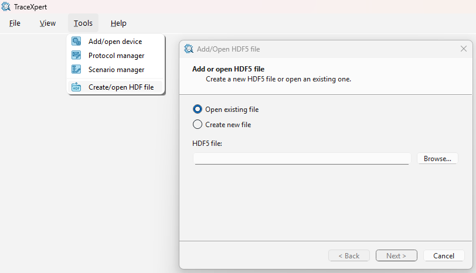
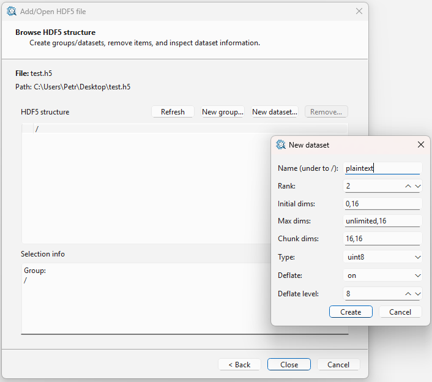
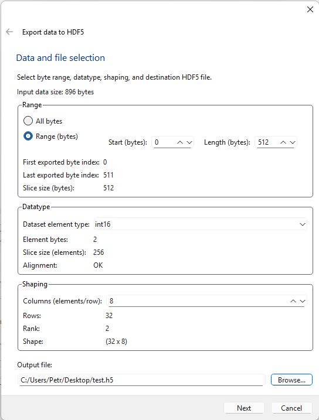
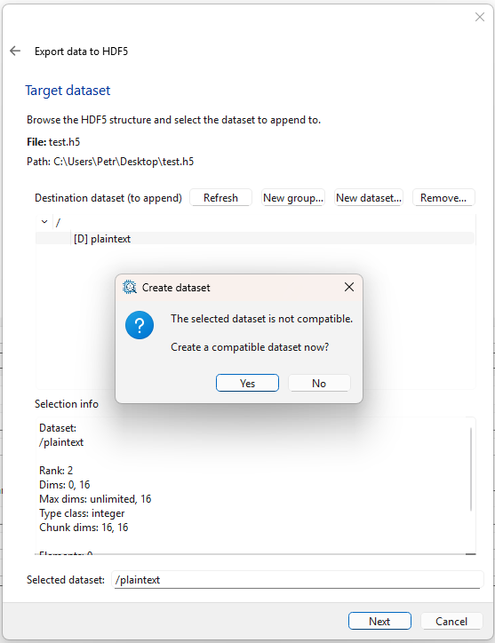
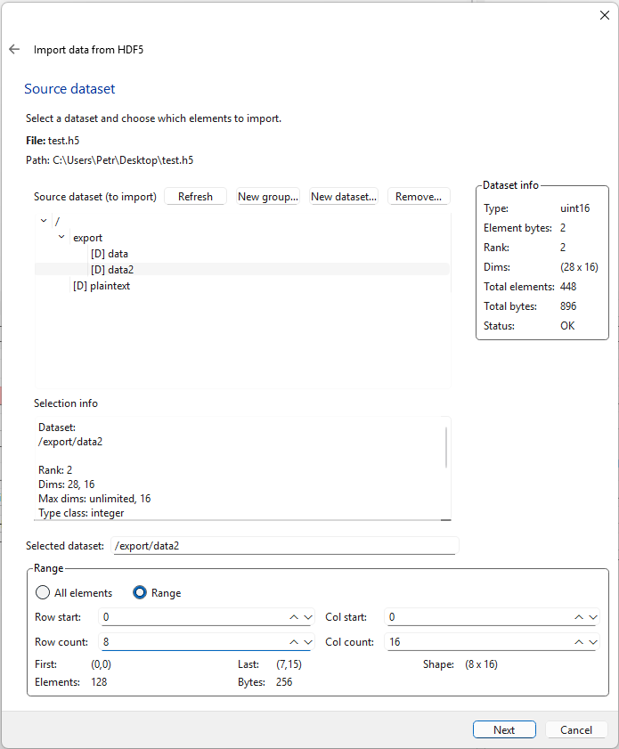
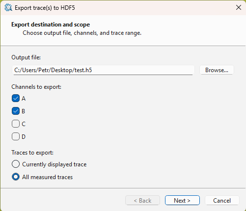
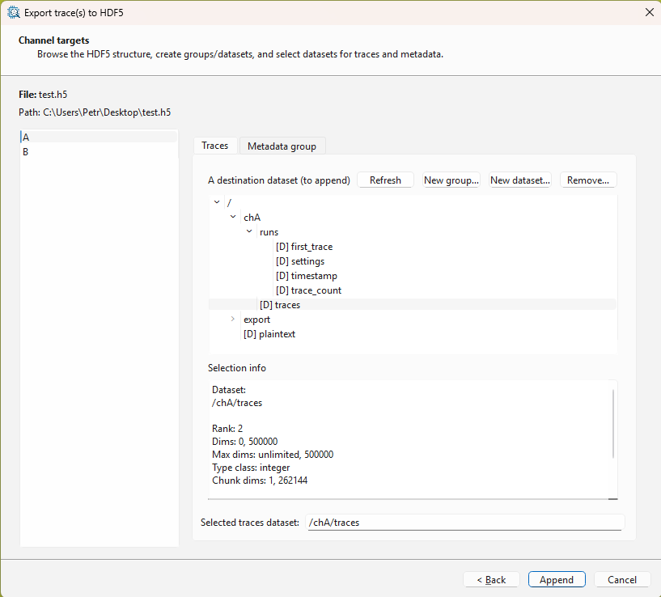

[Back to the top (index)](README.md)

# HDF5 import/export

TraceXpert 1.0 supports import and export to HDF5 files. Currently, following operations are supported:

- Creating new, or opening an existing HDF5 file, examining and altering its structure
- Exporting data received from an I/O device or from Analytical device
- Importing data from a file and sending it to an I/O device or an Analytical device
- Exporting power traces measured using an Oscilloscope device

The export/import is offered in the respective widgets as well as in a Scenario.

## Creating/opening a HDF file

When exporting/importing from a widget, a wizard opens leading you through the process, allowing to open or create a file.

However, when using a scenario (which is naturally non-interactive), a HDF file and appropriate datasets must be created beforehand. This can be done by selecting *Tools > Create/open HDF file*.

The following example shows a creation of a new dataset, intended for storing AES plaintext:

- Rank 2 (two-dimensional dataset)
- Initial dimensions 0,16 (empty dataset)
- Maximum dimensions unlimited,16 (blocks of plaintext will be appended along dim 0)
- Chunks dimesions 16,16 (so that 16 plaintexts/rows will ocuppy a single HDF chunk)
- Type uint8
- Deflate on, level 8 (compression is handled completely transparently)

For more information about individual parameters of the dataset, please refer to the HDF docs.

Furthermore, the datasets may be organized in groups. Various official or third-party tools are available for manipulation with HDF5 files.

## Exporting data from I/O or Analytical devices

When exporting data, a wizard opens, leading you through the export process.

All the received data (unless cleared from the widget) or only its part can be exported.

The data must be typed (keep uint8 when unsure), and may further be shaped into a rank-2 matrix.

In the next step, a compatible dataset must be selected (correct datatype, columns count). 

When no dataset is available, it may be created manually (New dataset). **Appropriate values are prefilled when New dataset is pressed, so that the dataset is compatible with previously defined values).** 

When the Next button is pressed and no compatible dataset is selected, the wizard offers to create one automatically. This is equivalent with selecting New dataset and confirming the dialog with no changes.

## Importing data

Similarly, when importing data, a dataset is selected and a range of data may be imported.

## Exporting power traces

Measured traces may be exported directly from the Oscilloscope widget as well.

After selecting channels and traces to export, compatible datasets must be selected for each channel. The exported channel requires a dataset with the correct datatype and columns=samples, so that each trace is represented as a row. 

Furthermore, metadata group is required for each channel. This group contains information about the measured traces. Each export appends:
- Index of the first appended trace (first_trace dataset)
- Number of exported traces (trace_count dataset)
- Timestamp of the export (timestamp dataset)
- Settings of the oscilloscope (settings dataset)

Compatible datasets for the traces may be created using *New dataset...* button with compatible values prefilled in the dialog. Simialarly, a compatible metadata group and its datasets may be created using *Create metedata group...* button.

When the *Append* button is pressed and there are errors in the selected datasets, the wizard offers to create compatible datasets (once again, this is equivalent to confirming default values in the aformentioned Create actions).

## Scenarios

When a scenario with components is run (I/O devices, Analytical devices, Oscilloscopes), their respective widgets are responsive and retain the send/received data. Therefore, the import/export may be done manually.

Furthermore, there are import/export blocks available in the scenarios. Given the non-interactive nature of the scenarios, only limited capabilities are offered in these blocks. An existing and valid dataset must be selected for both import/export, and its compatibility is validated prior to the scenario launch.

### Export block

The export block may be fed with bytes of data, regardless of the selected data type or shape of the dataset. The data is cached by TraceXpert and written to the HDF file once the cache threshold is met, or after the scenario finishes. For rank-2 datasets, only complete rows are appended to the dataset.

Warning: when the scenario finishes and an invalid amount of data was submitted to the block (incomplete elements, incomplete dataset row, etc.), the incomplete data will not be written to the file. In such case, an error is raised by the scenario block.

### Import block

The import block allows a byte-oriented read of the dataset. Be careful when reading larger elements (int32, float64, etc.), so an incomplete read wont occur (the block will not raise an error in such case).

The block allows for a **byte offset**, so that the data can be read from any position inside the dataset. When the byte offset is set incorrectly (e.g., it splits an element), a warning is raised by the block. 

