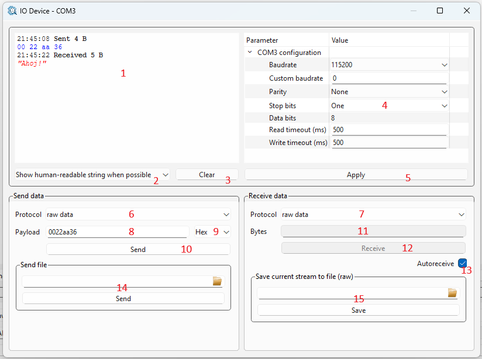

[Back to the top (index)](README.md)

# I/O Devices

Some TraceXpert components provide an **I/O Device**. This page describes standalone usage of the I/O Device using a graphical widget. *Furthermore, the I/O Device may be used in [Scenarios](scenarios.md) in an automated fashion.*

For further information about specific I/O Devices, please refer to the subpages describing individual I/O Device components.

## Initialization

Some components may offer an automatic detection of connected I/O Devices during their initialization, and create the I/O devices. E.g., the *[Serial port](serialport.md)* component detects all available serial ports and creates respective I/O devices. Other components, such as *[File](file.md)* requires manual addition of I/O devices representing desired files. See subpages related to specific components.

The I/O Device is then initialized in a similar fashion, as the component (through the wizard or right-clicking on it). Different I/O Devices may offer different pre-initialization and post-initialization parameters. 

When the I/O Device is initialized, an I/O Device widget opens. It can also be opened by right-clicking the I/O Device in the Project manager and selecting Show.

## I/O Device widget

The I/O Device widget allows to:

* Configure the I/O Device using its parameters.
* Send and receive data payload. Both input and output may be entered/displayed as hexadecimal values or human-readable strings.
* Send and receive protocol messages, see [Protocols](protocols.md).
* Send contents of a file, and receive data to a file.

Below is the widget screenshot with further description.

1. Communication log displays sent and received data.
2. Chooses if the communication logs shows human-readable strings when possible, or hexadecimal representation only.
3. Clears the communication log.
4. Post-initialization parameters of the I/O Device. These differ for every I/O Device. Tip: by hovering your mouse over the parameter, a hint is displayed. Always check the errors and warnings, possibly displayed on the right to every parameter.
5. Apply button confirms the set parameters. Check for the errors and warnings after applying the parameters.
6. Allows to select a communication protocol for sent data, see [Protocols](protocols.md) for more.
7. Allows to select a communication protocol for received data, see [Protocols](protocols.md) for more.
8. The payload data to be sent to the I/O Device.
9. Format of the entered data (8), either *Hex* for hexadecimal representation, or *ASCII*.
10. Send button sends the data to the I/O Device.
11. Number of bytes to be received from the I/O Device. 
12. Receive button attempts to receive specified number of bytes (11) from the I/O Device. If less data then requested is available, the receiving may last till timeout (behavior may be different for every component, check their documentation).
13. When **Autoreceive** is enabled, the widget receives the data continously. While this may be desirable for some devices (such as [Serial port](serialport.md)), it may be unwise for others (such as [Random number generator](rng.md)).
14. Allows for sending a file to the I/O Device.
15. Allows for receiving data from the I/O Device to a file.

