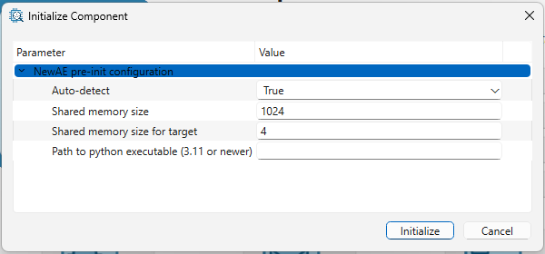
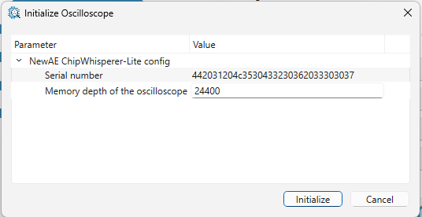

# NewAE (Chipwhisperer)

TraceXpert component *NewAE* provides access to devices made by NewAE. These devices are usually branded as Chipwhisperer.

The vast majority of devices are supported. The exception are CW nano, CW Leia and Husky-specific settings for CW-Husky. CW310 support is present but was not verified (as we do not own a CW310). CW305 support is in beta. Several devices can be used simultaneously. 

<u>To use this component</u>, you need a Python executable (either in a folder or in \$PATH). This exectuable must have the *chipwhisperer* and *PySide6* packages installed (via pip) and be at least Python3.11.

## Component initialization

Before initializing the component, plug in all the devices you want to use. All plugged in NewAE devices will be autodetected and **manual adding of devices is not supported**.

After initialization, the component will expose the oscilloscopes and targets separately (even if they are connected via the same cable). The oscilloscope should always be initialized first, as (in most cases) the respective target needs to be bound to the respective scope. This will be referred to as *non-standalone target*. The only *standalone targets* (meaning that they do not need a bound scope) are the FPGA targets CW305 and CW310.

### Pre-init parameters

- Auto-detect: should always be set to True.

- Shared memory size: keep default unless you are working with very large traces (unlikely for CW Liite / capture board).

- Shared memory size for target: keep default unless you are sending or receiving more than 3.8kB of data to/from the target at a time.

- Path to python: either 
  
  - a path to your configured python exectutable (keep requirements in mind) or 
  
  - blank, if your python is in \$PATH. 

## Oscilloscope

When initializing the scope, you need to set the memory depth. The default is the correct value for CW Lite / CW capture board. Please change this to the correct value if you are using CW Husky or other scope.

Initialization can take up to 30 seconds.

From now on, the scope behaves the same way as any other scope in TraceXpert. To configure it, use the post-init parameters which are split into three parts: 

1.    Top level (functions)
   
   - Those are the functions available from the python CW API. These are run, if the *Run?* parameter is set to *True*.

2.    NewAE
   
   - These parameters are used for configuration of the NewAE scope. Glitching may not be available.

3.    TraceXpert
   
   - Get taces as int: If set to *True*, the CW component will output traces as *int16*, of set to *False*, *double*s will be returned.
   
   - Mode: Choose between *Triggered* (recommended for most scenarios) and *Continuous*

All of these parameters are named identically to the [CW scope API documentation](Scope API &#8212; ChipWhisperer Documentation](https://chipwhisperer.readthedocs.io/en/latest/scope-api.html). Explanation of these parameters can also be found there

## Target (non-standalone - CW308, ...)

A corresonding scope must be initialized first. Then, these devices do not have any pre-init parameters. The only post-init parameter is baudrate (initially set to CW default).

After initialization, the device bahves as any other IO device. If you wish to use SimpleSerial, you need to define your own protocol.

## Target (standalone - CW305, CW310)

These devices **may** be bound to a scope (by a serial number), but they do not have to be. You may do that in pre-init params. There, you also must supply the bitstream file you want to be programmed onto the FPGA.

After initialization, you should check that the *is_done* and *is_programmed*parameters are set to *True*. This will make sure that the FPGA was programmed correctly.

The device may be configured using the post-init parameters, from where the CW305/CW310 specific functions may also be run.

To read from the device, you must first specify the *FPGA read address* in post-init params.

To write to the device, you must select whether you want to use the *fpga_read* or the *readOutput* function. If you select *fpga_read*, you must also specify the *FPGA write address* in post-init params.

All of the  parameters and functions are named identically to the [CW scope target documentation]([Target API &#8212; ChipWhisperer Documentation](https://chipwhisperer.readthedocs.io/en/latest/target-api.html#api-target-cw305)). Explanation of these parameters can also be found there
