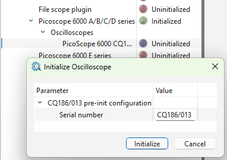
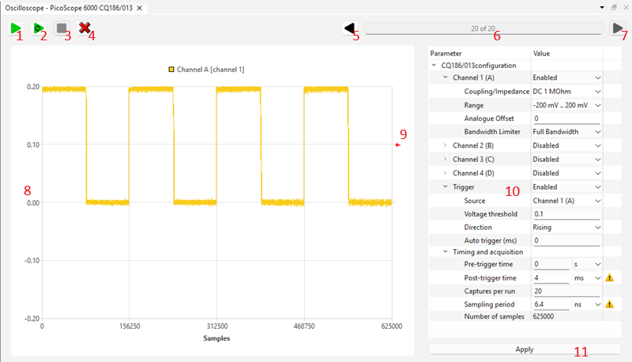

[Back to the top (index)](README.md)

# Oscilloscopes

Some TraceXpert components provide an **Oscilloscope** device. This page describes standalone usage of the Oscilloscope device using a graphical widget. *Furthermore, the Oscilloscope device may be used in [Scenarios](scenarios.md) in an automated fashion.*

For further information about specific Oscilloscopes, please refer to the subpages describing individual oscilloscope components.

## Initialization

Some components may offer an automatic detection of connected oscilloscopes during their initialization, and create the Oscilloscope devices. The Oscilloscope device is then initialized in a similar fashion (through the wizard or right-clicking on it):

When the oscilloscope is initialized, an Oscilloscope widget opens. It can also be opened by right-clicking the Oscilloscope device in the Project manager and selecting Show.

## Oscilloscope widget

The oscilloscope widget allows to:

* Configure the oscilloscope using its parameters, such as range, timing or trigger.
* Run the oscilloscope, download the samples and plot the trace.
* Measure single or multiple traces per oscilloscope run, when supported (set by an oscilloscope parameter).
* Run every oscilloscope multiple times, plot all of the captured traces.

Below is the widget screenshot with further description.

1. **Sample once**: Runs the oscilloscope. Captures either a single trace, or multiple traces when a higher **Captures per run** parameter is supported and set (see [Picoscope](picoscope6000.md)). If trigger is enabled, waits for the trigger, otherwise samples and returns immediately. Discards all previously measured data.
2. **Sample repeatedly**: Runs the oscilloscope repeatedly, until stopped by the *Stop* button. Discards all previously measured data.
3. **Stop**: Stops the oscilloscope/sampling.
4. **Clear trace data**: Discards all previously measured data.
5. **Previous trace**: Display the previously captured trace. Active when multiple traces were sampled.
6. **Displayed trace**: The number of the currently displayed trace / amount of captured traces overall. Multiple traces may be captured either using *Sample repeatedly* button or by setting multiple *Saptures per run* parameter, when supported by the oscilloscope.
7. **Next trace**: Display the next captured trace. Active when multiple traces were sampled.
8. **Traces plot**, with the samples/time on the horizontal axis, and voltage on the vertical axis.
9. **Trigger level** is visualised in the Traces plot by a red arrow, when the trigger is enabled.
10. **Post-initialization parameters** of the oscilloscope. Different components/oscilloscopes offer different parameters. Tip: by hovering your mouse over the parameter, a hint is displayed. Always check the errors and warnings, possibly displayed on the right to every parameter.
11. **Apply parameters** button confirms the set parameters. Check for the errors and warnings after applying the parameters.

