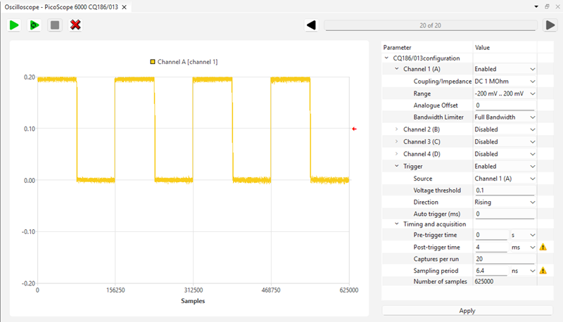

[Back to the top (index)](README.md)

# Picoscope 6000 A/B/C/D/E series

TraceXpert components *Picoscope 6000 A/B/C/D* and *Picoscope 6000 E series* provide access to Picoscope 6000 series USB oscilloscopes.

**The Picoscope Drivers and the Picoscope SDK must be installed on the system for the component to function properly.** 

The *Picoscope 6000 A/B/C/D* component supports 6000 A/B/C/D series oscilloscopes with up to 4 channels. The *Picoscope 6000 E series* supports newer models 6403E, 6404E, 6405E, 6406E, 6424E, 6425E, 6426E, 6428E-D, 6804E and 6824E (detecting up to 8 channels where available).

When **Auto-detect** is enabled, the connected oscilloscopes are detected and the respective Oscilloscope devices are automatically created.

When an oscilloscope is not detected or is connected after the initialization, user may either re-initialize the component, or add an Oscilloscope device manually. When adding the device manually, the serial number of the oscilloscope may be set during the Oscilloscope device initialization, or, when left empty, the first found oscilloscope is initialized.

## Oscilloscope post-initialization parameters

After the initialization, the parameters of the oscilloscope can be set.

1. **Channel** settings: Enabling/disabling the channel, settings its coupling and impedance, voltage range, analogue offset, enabling/disabling bandwidth limiter.
2. **Trigger** settings: Trigger source, voltage threshold, direction of the trigger (rising, falling, rising or falling, below, above). Auto trigger (ms) is the number of milisecond the oscilloscope waits if no trigger occurs (zero = wait forever).
3. **Timing and acquisition**: Pre-trigger and post-trigger times define the length of the trace to capture. The **Captures per run** parameter allows the oscilloscope to capture multiple traces (trigger occurences) per single oscilloscope run (Picoscope Rapid block mode). The **Sampling period** parameter may be adjusted by TraceXpert to the nearest possible value allowed by the oscilloscope. The previous settings then determine the number of samples, which is returned as a read-only parameter. The post-trigger time may be adjusted according to the selected sampling period (so it is divisible).

  

