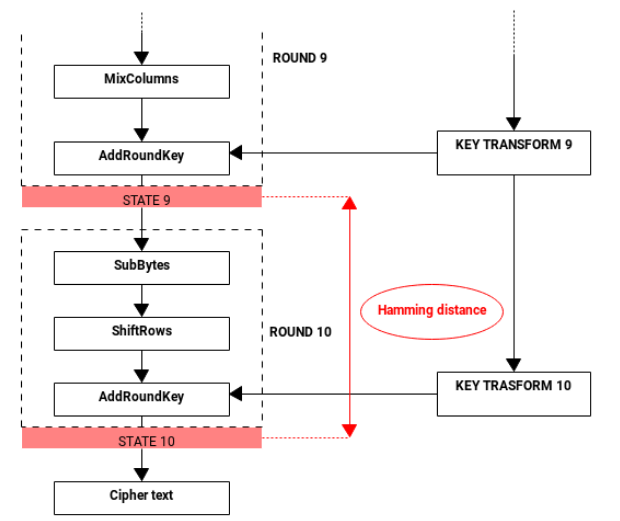

# Power predictions

TraceExpert plugin *Power predictions* creates power predictions suitable for a CPA attack.

## AES-128

The plugin contains an analytical device for AES-128. The device can be configured to work with two different power models:

1. Hamming weight or Identity of the S-box output in the first round (suitable for attacking SW implementations)
2. Hamming distance or Identity on the working register in the last round, as depicted (suitable for attacking HW implementations)

On the input stream, the AES-128 prediction device accepts full plaintexts or ciphertexts, depending on the selected power model (first round or last round, respectively).

When the "Compute predictions" action is launched, the device enumerates selected working values during the encryption for every submitted plaintext/ciphertext and every possible value of the key (i.e., 256 possible values of every byte of the key).

The device creates 16 output streams, one for each byte of the attacked key. Each output stream then returns 256 bytes for every submitted plaintext/ciphertext. Every byte contains either Hamming weight/distance or Identity, based on the settings.

E.g., consider Hamming distance settings and 10 submitted ciphertexts (i.e., 10\*16 bytes), followed by the "Compute predictions" action. The output stream for 4th byte then returns 10 vectors of 256 values, each value belonging to one of the key guesses on the 4th byte of the key. Each value is 1 byte. Every output stream therefore returns 10\*256 bytes of data.  

