[Back to the top (index)](README.md)

# Protocols

TraceXpert allows you to define *protocols*, 
which can be used with IO Devices for communication 
and data processing.

A protocol in TraceXpert consists of:

 - *protocol messages* – individual commands or responses within the protocol
 - *protocol message parts* – the components that make up each protocol message 

Typical use cases include:

- communicating with external devices (often via serial ports), using:
    - known protocols (e.g., NewAE SimpleSerial)
    - custom user-defined protocols 
- reading from and writing to files in a predefined format

## Creating a protocol

### Step 1: Open Protocol Manager
To create, edit, or remove protocols in your project:

1. In the **Project** view, navigate to **Protocols**.
2. Right-click and select **Open Protocol Manager**.

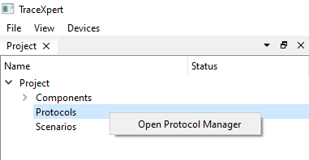

This opens the **Protocol Manager** window, 
which displays a list of existing protocols and 
provides options to add, edit, or remove them.

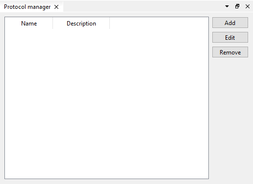

### Step 2: Create a new protocol

To define a new protocol, click **Add**.

You’ll now be guided through a wizard to define your protocol.

Provide a **name** and an optional **description** for the protocol, 
then click **Next**.

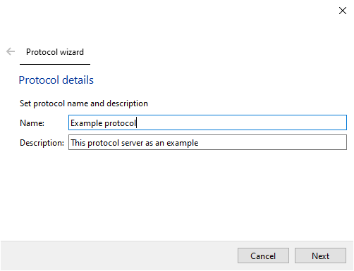

### Step 3: Create protocol messages

This step lets you manage the messages within your protocol.

- Messages can be added, edited, or removed.
- Each message will display a status indicating whether it’s valid.

To create your first message, click **Add**.

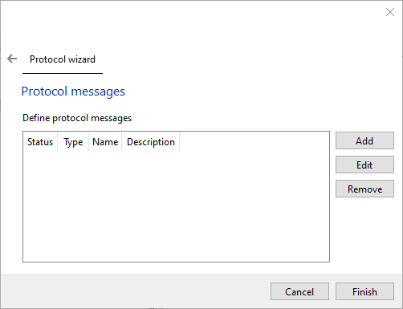

### Step 4: Fill in the protocol message details

Enter the **name**, **type** (either *command* or *response*), and an optional **description**.

> 💡 *For example: when communicating over serial, 
the message you send is a **command**, 
and the one you receive back is a **response**.*

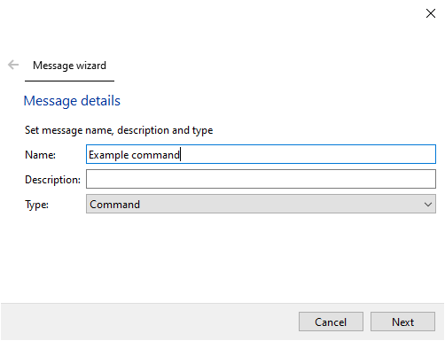

### Step 5: Define message parts

This step allows you to define the structure of the message 
by adding individual **message parts**.

- You can **add**, **edit**, **reorder**, or **remove** parts.
- A status indicator helps you verify the validity of the message as you build it.

To begin, click **Add**.

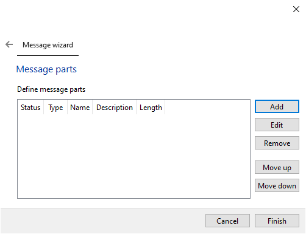

### Step 6: Fill in the message part details

Fill out the **name**, **description**, and select a **data type** for the message part.

**Data types** include:

- **Fixed length**: character, short, integer, long, etc.
- **Variable length**: string, byte array

You can also mark a message part as a **payload**. 
Payloads represent variable values that are filled in at runtime, 
such as when sending commands or receiving data from a device.

For variable-length payloads:

- You can define a **static length**, or
- Specify that the length is determined by another message part (of an appropriate data type).

For **multi-byte** values, you can also set the **endianness** (byte order).

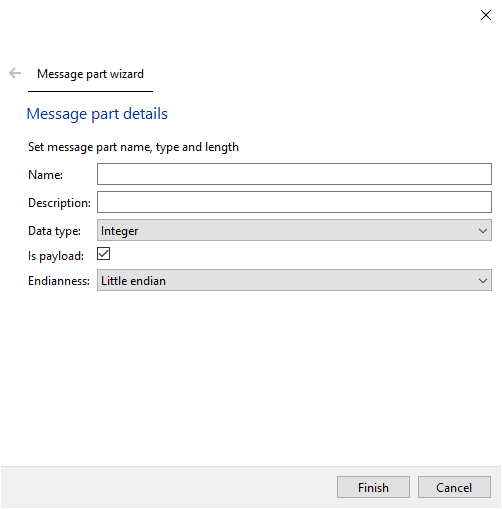

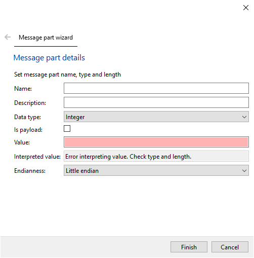

Once all message parts are defined, click **Finish** to return to the message list. From there, you can:

- Add additional messages, or
- Click **Finish** again to complete the protocol definition.

## Example: Creating a Command for a Custom Protocol

Let’s walk through an example. Suppose we have a simple custom protocol command used to **set a parameter** to a given value.

The command:

- Starts with a fixed byte `0xA9`
- Includes a 4-byte **integer** identifying the parameter
- Includes a **length byte** indicating the size of the following string
- Ends with a **variable-length string** containing the parameter value
- Terminates with a newline (`\n`)

### Structure of the Command:

1. **Byte**: `0xA9` – indicates command type
2. **4-byte integer** (variable): parameter ID
3. **Byte**: length of the string that follows
4. **String** (variable length): parameter value

To build this in the wizard, create the following message parts in order:

1. Fixed byte: `0xA9`  
   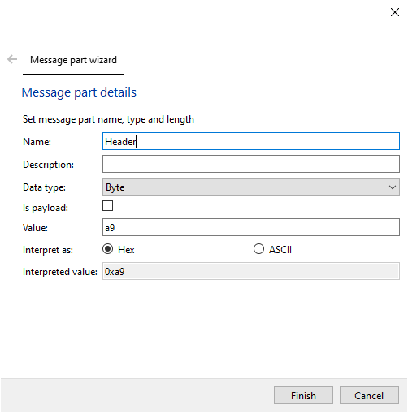

2. 4-byte integer: payload  
   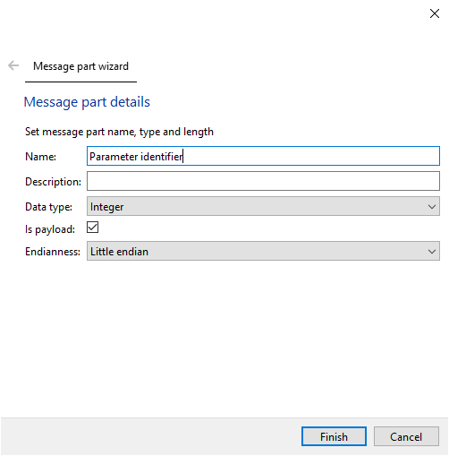

3. Length byte: indicates length of next field  
   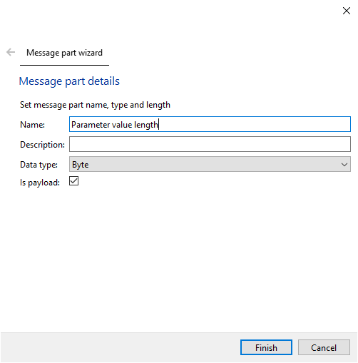

4. String: payload, variable length determined by previous length byte  
   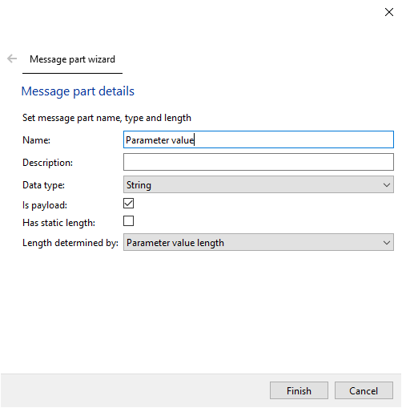

The result should look as follows:

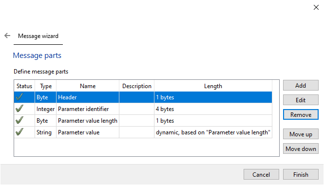

By following this process, you can define custom communication protocols tailored to your application’s needs, whether it’s interfacing with hardware or working with structured file formats.
