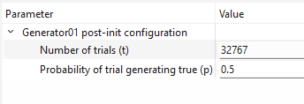

[Back to the top (index)](README.md)

# Random number generator

TraceXpert component *Random number generator* provides virtual I/O devices, which can be used to generate randomness.

No I/O devices are automatically created after component initialization and they need to be added manually. During initialization of the manually added I/O device, the following parameters must be set:

1. **Random number distribution**, which is either Uniform, Binomial, Geometric or Poisson.
2. **Result data type**, which is either bit-by-bit, or a signed/unsigned integer of size 16, 32 or 64.
3. **Seed** used for the random number generator. When "0" is set or the field is left empty, current time is used as a seed. 

## I/O Device post-initialization parameters

Other parameters, such as the distribution parameters, are set after the device initialization.

