# Scenarios
**TraceXpert** allows you to create *scenarios*—automated workflows 
represented as flow graphs. These scenarios can be used to automate 
processes using all the tools the program provides.

A scenario is made up of **blocks**, each performing a specific task.  
Blocks are connected using **input** and **output** connections:

- Every block has a **flow input** and **flow output** port, these control the order of execution.
- Most blocks also have **data input** and **data output** ports, their connections define how data is passed between blocks.

## Block Types

Blocks are organized into several categories:

- **Flow blocks** – control the execution path of the scenario  
  - Examples: `Flow start`, `Flow end`, `Flow merge`, `Condition`, `Loop`, `Delay`

- **Miscellaneous blocks** – provide general-purpose functionality  
  - Examples: `Logger`, `Constant`, `Script`, `Variable`

- **Component blocks** – interact with external tools and devices
  - Examples: read/write operations with `IO Devices`, or interfaces for the `Oscilloscope` and `Analytic` modules

## Creating a scenario

### Step 1: Open Scenario Manager

To create, edit, or remove scenarios in your project:

1. In the **Project** view, navigate to **Scenarios**.
2. Right-click and select **Open Scenario Manager**.

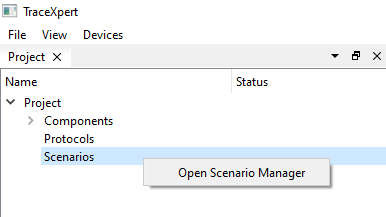

This opens the **Scenario Manager** window, 
which displays a list of existing scenarios and 
provides options to add, edit, rename or remove them.

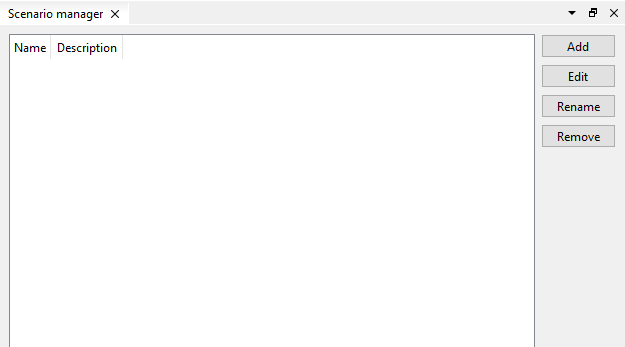

### Step 2: Create a new scenario

To create a new scenario, click **Add**.

Provide a **name** and an optional **description** for the scenario, 
then click **Add**.

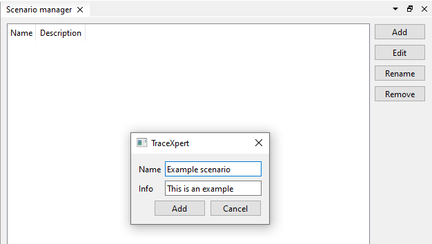

The scenario is created and a new entry appears in the **Scenario Manager**.

### Step 3: Edit the scenario
Double click the new entry, or select it and click **Edit**.


The **Scenario Editor** window opens, with the *scenario canvas* in the middle. 


### Intermezzo: Scenario Editor Basics
Take a second to familiarize yourself with the **Scenario Editor** control elements.

#### Toolbar (Top Left)

A toolbar with icons to **Run**, **Stop**, and **Save** your scenario.
The following icons allow you to **Push back**, **Bring to front**, and **Delete** scenario blocks.

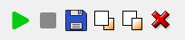

#### Canvas Tools (Top Center)

These are tools for interacting with the canvas and blocks:

- **Drag tool** – move the canvas
- **Cursor tool** – select and manipulate blocks
- **Line tool** – create connections between blocks
- **Zoom selector** – adjust the zoom level  
  *(You can also zoom using `Ctrl + Mouse Wheel`)*

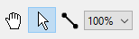

#### Block Panel (Left Side)

A panel listing all available blocks, organized by category:

- Flow blocks
- Miscellaneous blocks
- Component blocks

You can place blocks onto the scenario canvas by clicking them, moving them into the desired position and clicking again.


#### Run Log (Bottom)

The bottom panel displays the **run log**, which shows real-time output and messages while the scenario is running.

### Step 4: Add start and end point

Every scenario must begin with a **Flow start** block and end with a **Flow end** block. These define the execution entry and exit points.

Start by selecting these blocks and placing them into the scenario canvas.

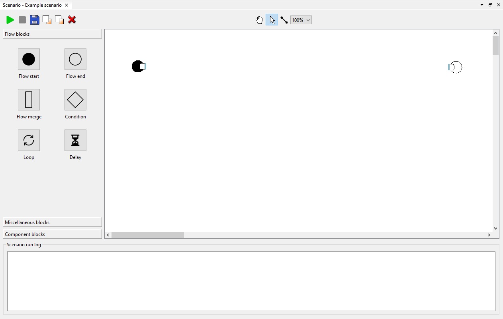

### Step 5: Add blocks

Let's now create a simple scenario, which will print "Hello, world!" three times in a row. 

Start by placing the **Loop**, **Constant** and **Logger** blocks onto the canvas.


### Step 6: Connect flow and data ports

Continue by connecting the blocks. Then drag a line from  any output port to any input port. 

In the top center toolbar, select the **Line tool**.

The flow ports *(blue)* will define the order of block execution, whereas the data ports *(orange)* move the data from block to block.

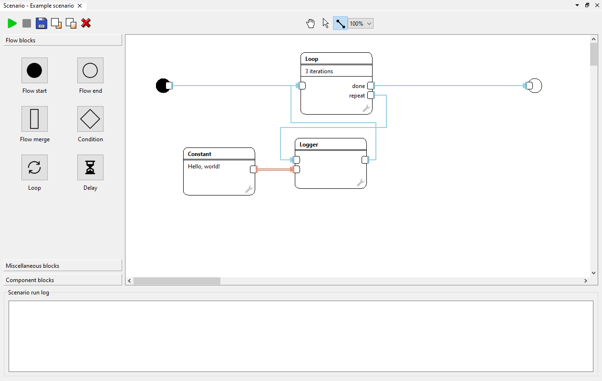

### Intermezzo: Flow and Data connection rules

Connections from a single **data output** port can be branched.

Connections from a single **flow output** port can **NOT** be branched.

> 💡 *The scenario execution flow can **NEVER** be split into two parallel paths which would **run simultaneously**. It can however be split into two exclusive paths by e.g. a condition block.*


Connections from multiple **data output** ports can **NOT** be joined into one **data input**.

Connections from multiple **flow output** ports can be joined into one **flow input**. 

> 💡 *An equivalent connection can also be made using the **Flow merge** block.*

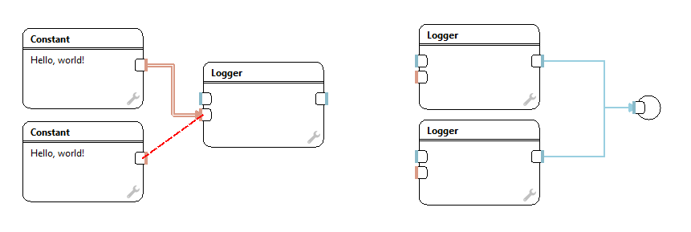

### Step 7: Run the scenario

When you're satisfied with the look of your scenario, it is time to run it.

To run the scenario, click the green **Run** button in the top left toolbar.
The output of the run will appear in the **Scenario run log** in the bottom of the editor window.

When the scenario finishes, the **Flow end** block through which the scenario has ended will be highlighted light blue.

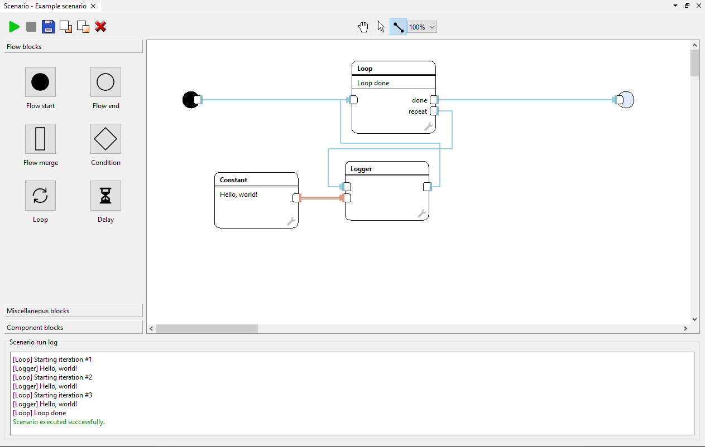

### Step 7: Edit the block settings

Let's say we want to print "I'm a TraceXpert!" five times.

To achieve this, we can modify the **Constant** and **Loop** blocks. 

> 💡 *You can modify any blocks with the wrench icon in the bottom right corner.*

Start by editing the Constant block by double clicking it.
You can now modify the **Value** field.

> 💡 *Notice that you can also modify the block's display name.*

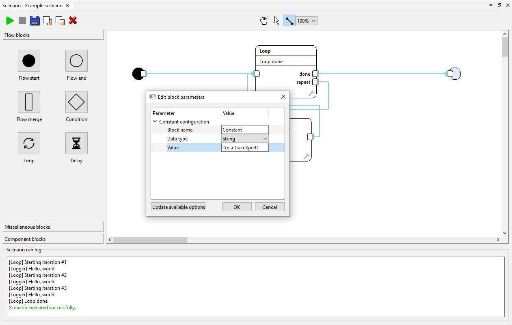

Continue by editing the Constant block, changing the **Number of iterations**.

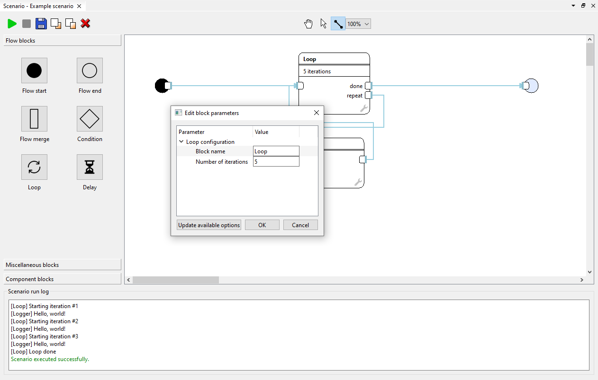

After you're done editing, the scenario should look as follows.

You can run the scenario now and observe the change in the **Scenario run log**.

> 💡 *Notice that during scenario execution, the loop block displays the current iteration number.*

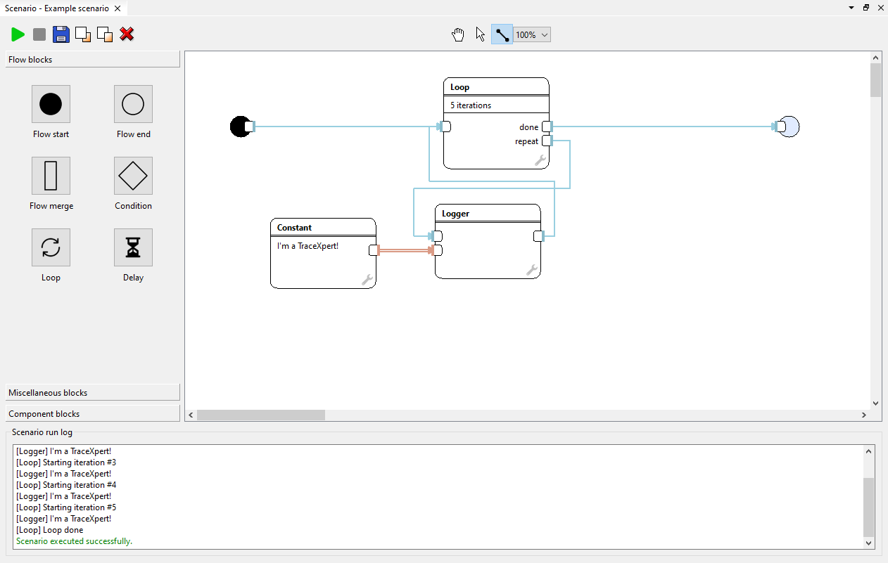

## How to use other available blocks

> 💡 *When you hover over a block or its port, a name and description appears in a tooltip. This can provide hints for the block's/port's usage.*

### Variables

To reduce the need for long and messy data connections, it is possible to use **Variable** read and write blocks. The **Variable** blocks basically work as wormholes for data connections.

The variables are identified by name, which can be any string.

An example usage of **Variable** blocks can be seen below.


### Writing to untracked files

Writing to files can be accomplished by adding files to the project and using the **IO device: write** blocks.

However, this is not feasible for tens or hundreds of files. It is also not necessary to add files to a project if they are only used once.

For these purposes, the **Write to: untracked file** block can be used.

In this block's settings, you can set:
- the path to the destination folder, where files will be generated
- the file name
- the *Write mode*

The *Write mode* can be one of these options:
- *Create new file on each input:* a new file will be created each time the block is run, the files will be numbered sequentially
- *Append to single file on each input:* a single file will be created and each time the block is run, the file will be appended
- *Override single file on each input:* a single file will be created and each time the block is run, the file will be overwritten

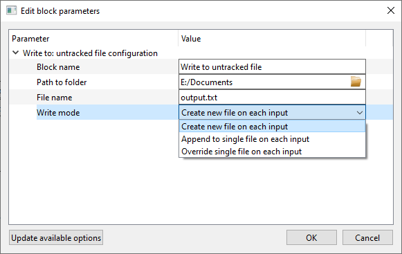


An example usage of the **Write to: untracked file** block can be seen below.


### Scripting

The **Script** block allows you to incorporate Python scripts into your scenario.

In this block's settings, you can set:
- the path to Python executable (otherwise default `python` is used) **! TO BE IMPLEMENTED !**
- *Input count* - the number of **data inputs** the block should have
- *Output count* - the number of **data outputs** the block should have

Values from **data input ports** is passed to the script in the `input_raw` array. 
You can access this array directly, or you can use the `tstring, tint, treal...` convenience functions as outlined in the instructions.

The script's output data has to be returned from the `process_data` function.
The return value has to be an array with the same number of elements as is set in the block settings. The values from individual array indexes will be passed to corresponding **data output ports**.

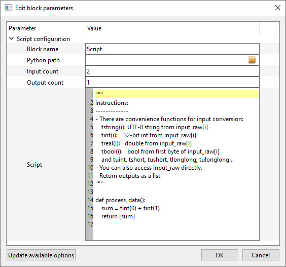

In your script, you can use the NumPy package as follows:

```
import numpy as np

def process_data():
    pt = np.frombuffer(input_raw[0], dtype=np.uint8)
    key = np.frombuffer(input_raw[1], dtype=np.uint8)
    state = np.bitwise_xor(pt, key)
    #apply sbox...

    return [state.tobytes()]
```
If you want to return a single value instead of an array, you need to convert the output to a byte array:

```
import numpy as np

def process_data():
    arr = np.frombuffer(input_raw[0], dtype=np.uint8)
    hd = np.bitwise_xor.reduce(arr)

    return [hd.tobytes()]
```


### IO Device reading and writing

In order to read from and write to IO Devices (which can be files, serial ports, smart card readers etc.) the **IO Device: Read** and **IO Device: Write** blocks can be used.

These blocks cannot be used before being configured first, so when you first place them onto the scenario editor canvas, they are in an error state.

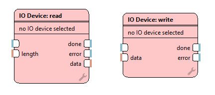

To configure the blocks, double click them. The **Edit block parameters** window appears.

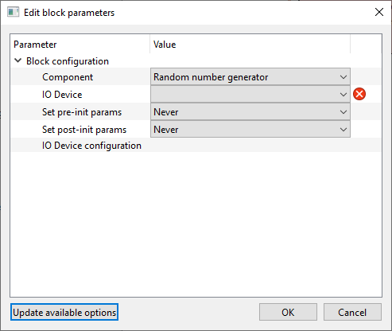

In this window, it is necessary to select the Component, which the IO Device you want to use is from, and the IO Device itself.

> 💡 *If there are any errors in your configuration, they will show up on the right side along with an explanation.*
> 
> 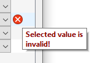

When you select an IO Device, its pre- and post-init parameters will be shown.

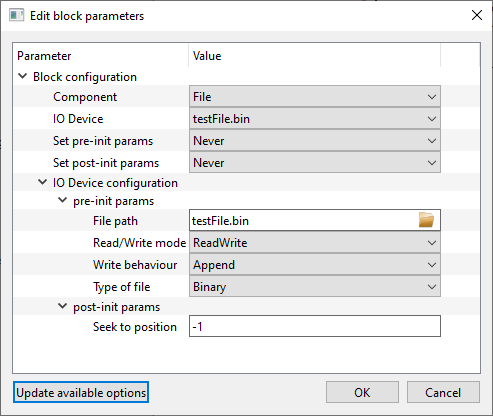

However, these parameters will not be applied unless one of the following options is selected:


> 💡 *The **Update available options** button is used to refresh block configuration options that might have changed in the project while the scenario editor was opened, such as adding or removing devices, protocols, etc. It also prevents accidental overwriting of the IO Device configuration.*

When the block is set up successfully, the blocks in the scenario show the selected IO Device.

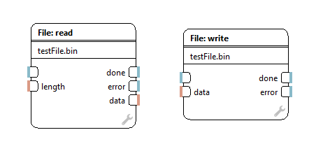

### Formating Protocol messages

In order to use your defined protocols along with their messages, you can use the **Protocol: format message** block.

This block cannot be used before being configured first, so when you first place it onto the scenario editor canvas, it is in an error state.

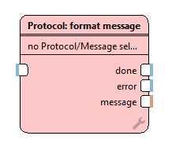

To configure the blocks, double click it. The **Edit block parameters** window appears.

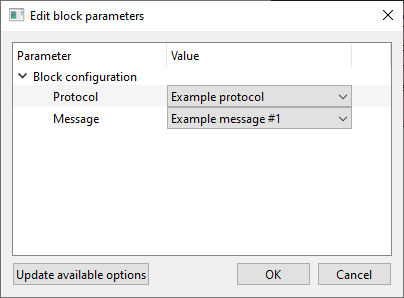

In this window, it is necessary to select the Protocol and the Protocol Message the block is supposed to format.

If a message with payload inputs is selected, they will appear as inputs into the block.


> 💡 *If you update the protocol message definitions, remember to use the **Update available options** for the changes to take effect.*

### Oscilloscope interfacing

Scenarios currently offer two ways to use oscilloscopes. 

Either, the **Oscilloscope: single capture** block can be used alone, or the **Oscilloscope: start measurement** and **Oscilloscope: download data** blocks can be used together.

The **Oscilloscope: single capture** block performs a single capture and blocks until the measurement is done (until all data is received from the oscilloscope). This means any setup for the measurement has to be done before the measurement. 

The **Oscilloscope: start measurement** and **Oscilloscope: download data** blocks also perform a single capture, but during the measurement, the user can perform actions in the scenario.

The **Oscilloscope: single capture** block and **Oscilloscope: start measurement** have the same settings - Component and Oscilloscope selection, pre- and post- init parameters. Same rules apply for the parameters as with [IO Devices](#io-device-reading-and-writing).

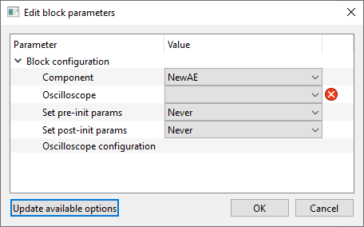
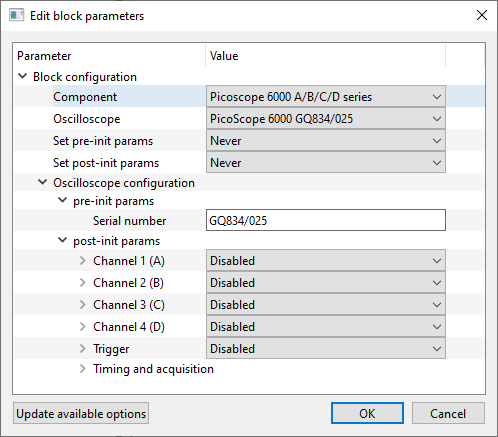

The **Oscilloscope: single capture** block shows an error state until an Oscilloscope is assigned. The data ouput ports are as follows:

- **data** - raw measured data
- **#traces** - total number of traces
- **#samples** - total number of samples per trace
- **data type** - data type as string
- **overvoltage** - boolean indicator of overvoltage

> 💡 The data type can be one of: *UInt8, Int8, UInt16, Int16, UInt32, Int32, Real32, Real64*

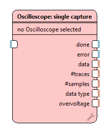
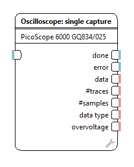

The **Oscilloscope: start measurement** block also shows an error state until an Oscilloscope is assigned. The data ouput ports on the **Oscilloscope: download data** are identical as on the **single capture** block.

The following image shows a part of an example scenario.
The **Oscilloscope: start measurement** and **Oscilloscope: download data** have to be connected together through the purple "connection" ports in order to work.

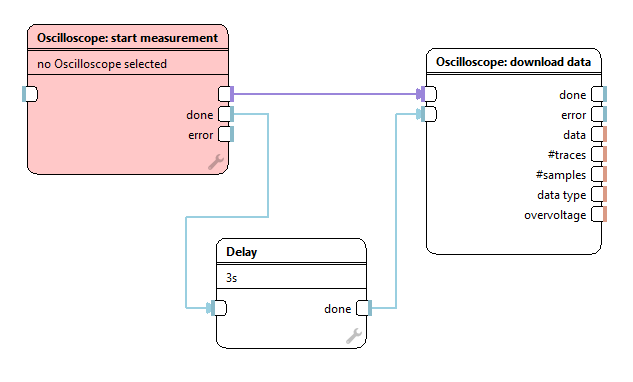
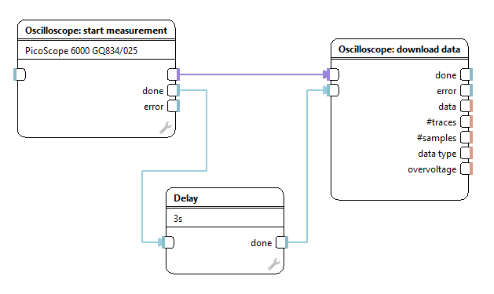
