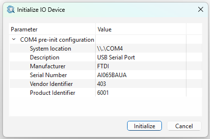
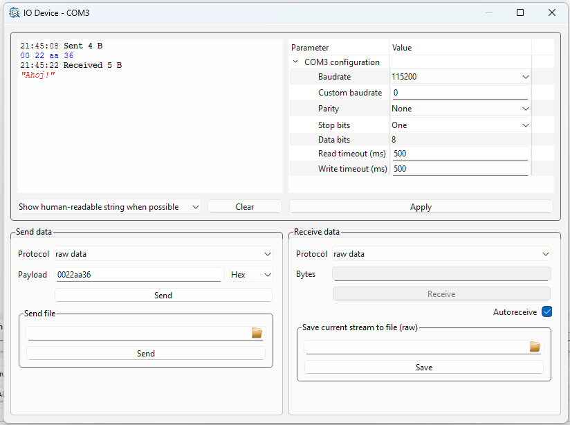

[Back to the top (index)](README.md)

# Serial port

TraceXpert component *Serial port* provides access to serial ports and terminals (COM ports on Windows, terminal devices such as /dev/ttyS0 or /dev/ttyACM0 on Unix).

When **Auto-detect** is enabled during initialization, the component tries to detect available serial ports, and it automatically creates respective I/O devices.

When a serial port is not detected or is connected after the initialization, user may either re-initialize the component, or add an I/O device manually. When adding the device manually, the system path to the serial port must be set during the I/O device initialization.

## Parameters

After the initialization, a serial port I/O device offers following parameters:

1. **Baudrate**, which offers values available on the system. Furthermore, it allows a **Custom** option, see *Custom baudrate* parameter.
2. **Custom baudrate** is applied only when the *Baudrate* is set to *Custom*. **Warning**: The set custom baudrate must be supported by the used hardware (such as system port or a USB-RS232 converter). The use of an unsupported custom baudrate **may not** be detected by TraceXpert, resulting in a malfunctional setup!
3. **Parity**, which may be None, Even or Odd.
4. **Stop bits**, which may be One or Two.
5. **Data bits**, where only 8 is a valid value.
6. **Read and Write timeouts** of the underlying system API. Given a 500 ms read timeout, TraceXpert will wait for 500 ms when receiving data, before returning less than the requested number of bytes.  

