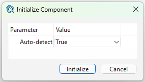
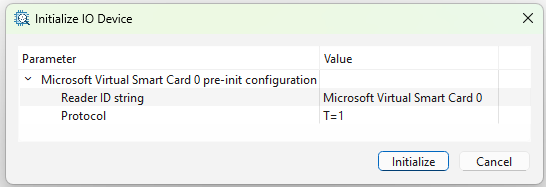

[Back to the top (index)](README.md)

# Smart card

TraceXpert component *Smart card* provides access to Smart card readers.

Currently (release 1.0), the Smart card component is only supported on the Windows platform. 

When **Auto-detect** is enabled during initialization, the component tries to detect available readers, and it automatically creates respective I/O devices.

When a smartcard reader is not detected or is connected after the initialization, user may either re-initialize the component, or add an I/O device manually. When adding the device manually, the Reader ID string must be set during the I/O device initialization.

Only the T=1 protocol is currently supported.

## Parameters

After the initialization, a Smart card I/O device offers following parameters:

**Input format**, which is either:

1. **Command APDU**, in which case the whole properly formatted APDU must always be provided. The raw payload is sent to the Smart card. 
2. **Data only (pre-defined command APDU)**, in which case the APDU is automatically generated by the component, according to the settings described later.

**Output format**, which is either:

1. **Response APDU**, in which case, the Receive operation returns the raw data as received from the smart card.
2. **Data only (SW1-SW2 stripping)**, in which case the SW1 and SW2 bytes are stripped from the smart card response by the component.

**Data only: pre-defined command APDU** parameter and its subparameters are used for generation of the APDU, when the Input format is set to *Data only (pre-defined command APDU)*. The byte-sized **CLA, INS, P1, P2, Le** parameters must be manually set in hexadecimal (00-FF). The **Lc** parameter, which holds the size of the sent data, is automatically computed by the component.

