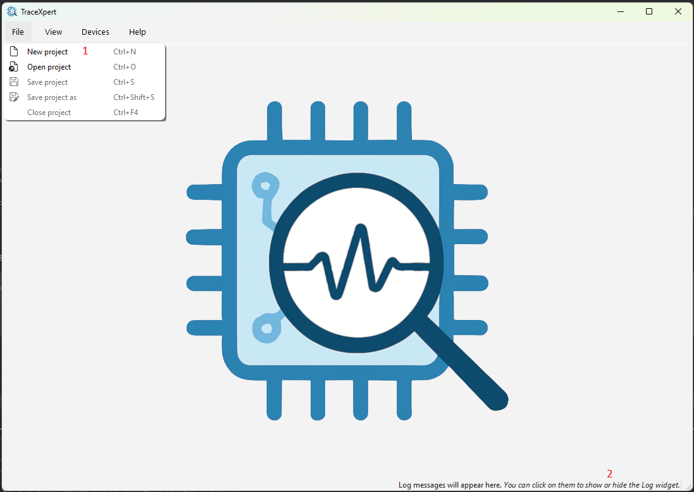
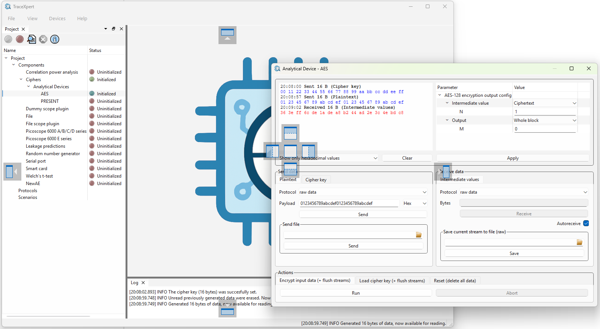

[Back to the top (index)](README.md)

# User interface and Projects

After launch, a main window opens:

1. The menu on the top offers basic project management: *New project*, *Open project*, *Save project* and *Save project as*, as well as *Close project*.
2. The bottom status line shows the latest messages from the TraceXpert log. *Clicking on the status line opens the log.*

After a project is opened/created, [a component and a device may be initialized using Open Device Wizard, Project Manager or from the Welcome screen](components-devices.md).

The [Protocols](protocols.md) manager may be opened by right clicking *Protocols* in the Project Manager or using the Welcome screen.

The [Scenarios](scenarios.md) manager may be opened by right clicking *Scenarios* in the Project Manager or using the Welcome screen.

## Docking

The Project Manager is by default docked to the left, the log to the bottom and the Device widget to the top right:

However, every tab, such as Project Manager or Device widget is draggable into a separate window or dockable in the main window:

